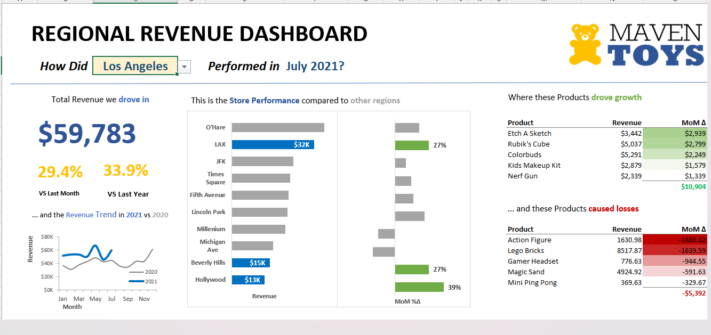
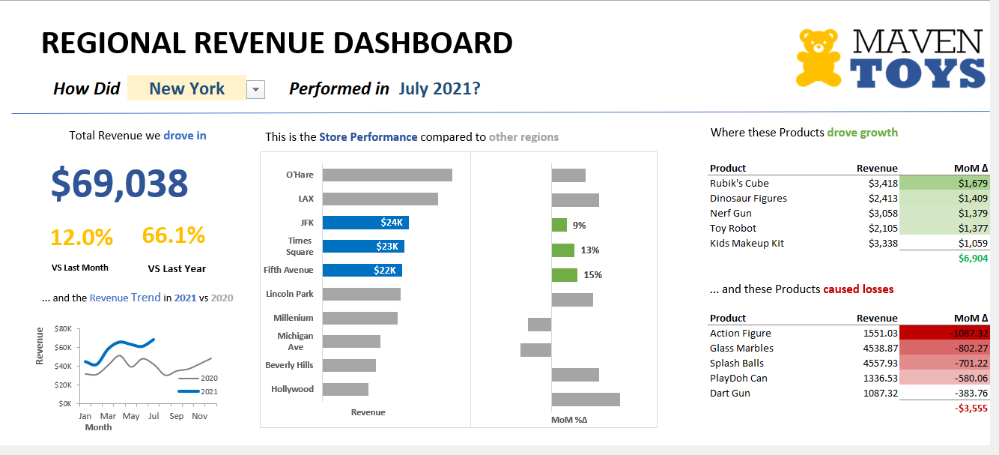
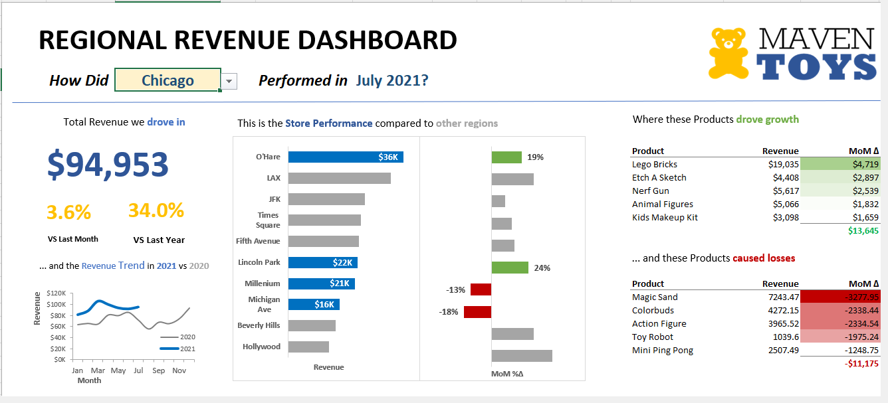

# 📊 Maven Toys — Regional Revenue Dashboard

> An interactive Excel dashboard built for Maven Toys' Regional Sales Managers to monitor monthly revenue performance, track YoY/MoM trends, and identify top-performing and underperforming products across regions.

---

## 🖼️ Dashboard Preview

| Los Angeles | New York | Chicago |
|---|---|---|
|  |  |  |

---

## 📌 Project Overview

**Client:** Maven Toys (fictional toy store chain — US)  
**Role:** Lead Business Intelligence Analyst  
**Tool:** Microsoft Excel  
**Dataset:** `MavenToys_Monthly_Sales.xlsx`  
**Period Covered:** January 2020 – December 2021  

The COO requested a unified dashboard that Regional Sales Managers could use during monthly calls to:
- Filter performance by **region** using a dropdown
- Track **monthly revenue trends** vs the prior year
- Compare **store-level performance** within each region
- Identify which **products drove growth** and which **caused losses** (Month-over-Month)

---

## ✨ Key Features

- 🔽 **Region Selector** — Dropdown filter to switch between regions (Los Angeles, New York, Chicago, etc.)
- 📈 **Revenue Trend Chart** — 2020 vs 2021 monthly line chart for the selected region
- 🏬 **Store Performance Bar Chart** — Revenue by store with MoM % delta comparison
- 🟢 **Top Growth Products Table** — Top 5 products with highest positive MoM delta
- 🔴 **Loss Products Table** — Top 5 products with highest negative MoM delta
- 💰 **KPI Cards** — Total Revenue, % vs Last Month, % vs Last Year

---

## 📁 Repository Structure

```
maven-toys-dashboard/
│
├── MavenToys_Regional_Revenue_Dashboard.xlsx   # Main Excel dashboard file
├── README.md                                   # This file
├── PROJECT_BRIEF.md                            # Project background and objectives
│
└── screenshots/
    ├── dashboard_la.png                        # Los Angeles view
    ├── dashboard_ny.png                        # New York view
    └── dashboard_chicago.png                   # Chicago view
```

---

## 📊 Dashboard Walkthrough

### 1. Region Filter
Select any region from the dropdown at the top. All charts and tables update dynamically to reflect the chosen region and the most recent available month (July 2021).

### 2. KPI Summary
Three headline numbers appear on the left:
- **Total Revenue** for the selected region in the current month
- **MoM %** — Change vs the prior month
- **YoY %** — Change vs the same month last year

### 3. Revenue Trend (Line Chart)
A dual-line chart comparing 2020 vs 2021 monthly revenues, helping managers spot seasonal patterns and year-over-year improvement.

### 4. Store Performance (Bar Chart)
Horizontal bars rank stores by revenue within the region. Highlighted (blue) bars are top performers. Green bars on the right show positive MoM % growth; red bars indicate declines.

### 5. Product Tables
Two conditional-formatted tables highlight:
- **Growth Drivers** — Products with the largest positive MoM revenue swing
- **Loss Drivers** — Products with the largest negative MoM revenue swing

---

## 🔍 Sample Insights (July 2021)

| Region | Total Revenue | MoM | YoY | Top Growth Product | Biggest Loss |
|---|---|---|---|---|---|
| **Chicago** | $94,953 | +3.6% | +34.0% | Lego Bricks (+$4,719) | Magic Sand (−$3,278) |
| **New York** | $69,038 | +12.0% | +66.1% | Rubik's Cube (+$1,679) | Action Figure (−$1,087) |
| **Los Angeles** | $59,783 | +29.4% | +33.9% | Etch A Sketch (+$2,939) | Action Figure (−$1,881) |

---

## 🛠️ Tools & Techniques

| Skill | Application |
|---|---|
| Excel PivotTables | Aggregating sales by region, store, and product |
| Named Ranges & Data Validation | Region dropdown selector |
| Dynamic Chart Linking | Charts auto-update with filter selection |
| Conditional Formatting | Color-coded MoM delta tables (green/red) |
| VLOOKUP / INDEX-MATCH | Pulling KPIs and product rankings dynamically |
| Custom Number Formatting | Currency display, percentage KPIs |

---

## 🚀 How to Use

1. **Download** `MavenToys_Regional_Revenue_Dashboard.xlsx`
2. **Open** in Microsoft Excel (2016 or later recommended)
3. **Enable macros/content** if prompted
4. Use the **region dropdown** (cell B3) to select your region
5. All visuals and tables update automatically

---

## 👤 About

**Created by:** Bushra Khan  
**Portfolio:** [thedataalchemist.co](http://thedataalchemist.co)  
**LinkedIn:** [linkedin.com/in/bushra-nazeer-khan](https://www.linkedin.com/in/bushra-nazeer-khan/)  
**GitHub:** [github.com/BushraKhan359](https://github.com/BushraKhan359)  
**Date:** July 2021 (Dataset Period)

---

*This project was built as part of a data analytics portfolio to demonstrate proficiency in Excel dashboard design, business intelligence, and data storytelling.*
